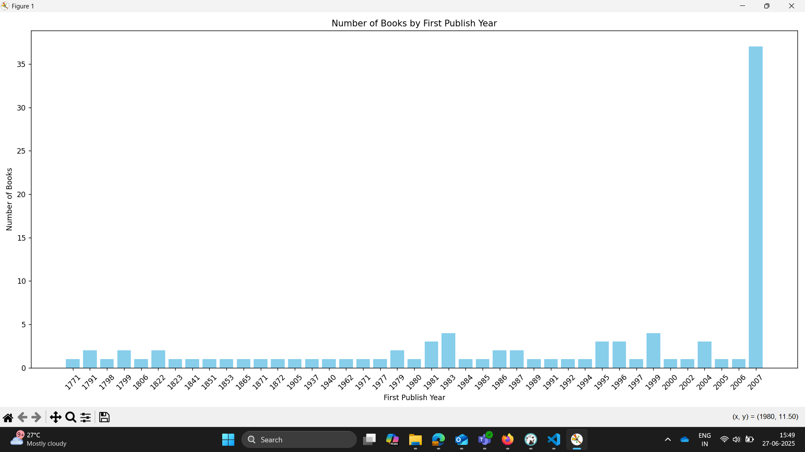

# Open Library Book Analysis Project Repo

## Overview

This project demonstrates how to fetch, clean, store, and visualize book data from the [Open Library API](https://openlibrary.org). The workflow is fully automated using Python and MySQL, and the code is organized into clear, reusable classes.

## What the Code Does

1. **Fetches Data:**  
   Uses the Open Library API to retrieve the top 100 books, including their titles, authors, and first publish years.

2. **Cleans Data:**  
   Processes and standardizes the raw data, ensuring only valid books and authors are included. Invalid or incomplete records are skipped.

3. **Stores Data in MySQL:**  
   - Raw data is stored as JSON for reference.
   - Cleaned data is normalized into three tables: `cleaned_books`, `authors`, and a linking table `book_authors` to handle the many-to-many relationship between books and authors.

4. **Visualizes Data:**  
   Generates a bar chart showing the number of books published per year using matplotlib.

## Main Components

- **BookFetcher:** Fetches book data from the Open Library API.
- **BookCleaner:** Cleans and validates the raw data.
- **BookDatabase:** Handles all MySQL database operations, including table creation and data insertion in a normalized form.
- **BookVisualizer:** Plots the number of books published by year.

## Database Access and Exploration

- The MySQL database is connected to [DBeaver](https://dbeaver.io/) for easy access and visualization of the stored tables and data.
- A `script.sql` file is provided with useful SQL queries to read and explore the data, such as:
  - Viewing all raw and cleaned book records
  - Listing all authors
  - Showing which authors wrote which books
  - Counting books per author and per year

## How to Use

1. **Set up your MySQL database** and update your `.env` file with your credentials.
2. **Run `main.py`**. The script will:
   - Fetch and clean the data
   - Store both raw and cleaned data in the database
   - Visualize the results in a bar chart
3. **Explore your data** in DBeaver or using the provided `script.sql` queries.

## Database Design

- **cleaned_books:** Stores unique books (title, year).
- **authors:** Stores unique authors.
- **book_authors:** Links books and authors (many-to-many relationship).

This structure follows best practices for database normalization (up to 3NF).

## Visualization

The script produces a bar chart showing how many books were published each year, based on the cleaned data.

This is the visualization created by a query in the `BookVisualizer` class.  
You can add any SQL query you want to visualize and update the code to generate the required visualization.

---

For a detailed progress log, see [PROGRESS_LOG.md](PROGRESS_LOG.md).
